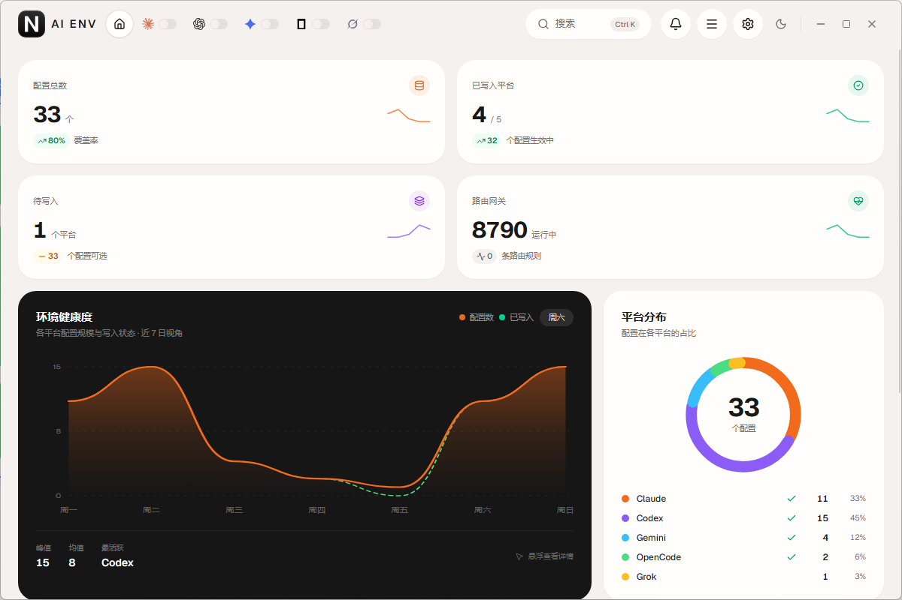

<p align="center">
  
</p>

<h1 align="center">AI ENV</h1>

<p align="center">
  面向 Claude Code、Codex、Gemini CLI、OpenCode、Grok 的本地桌面工作台。<br />
  一处管理环境配置、MCP、Skills、本地 API 路由、监控轮换、云端备份和本机 CLI。
</p>

<p align="center">
  <a href="./README.md"><strong>中文</strong></a> ·
  <a href="./README_EN.md">English</a>
</p>

<p align="center">
  <a href="https://github.com/nsmao-com/claude-code-env-change/releases"></a>
  <a href="./LICENSE"></a>
  
  
  
  
</p>

<p align="center">
  
</p>

## 这是什么

把五套 CLI 的环境变量、MCP 服务器、Skills、提示词、用量统计和本机安装收进同一个原生窗口。配置写在本机，不经过第三方账号；换电脑时可以用 S3 兼容对象存储加密备份。

当前版本 **v2.4.0**。版本说明和安装包见 [GitHub Releases](https://github.com/nsmao-com/claude-code-env-change/releases)。

## 功能

| 模块 | 说明 |
| --- | --- |
| 环境 | 多配置、按平台筛选、拖拽排序、一键写入对应 CLI、延迟测速、JSON 拖拽导入 |
| MCP | 管理 stdio / HTTP 服务器，同步到 Claude / Codex / Gemini / OpenCode / Grok |
| Skills | 编辑 `SKILL.md`，从在线市场 / 内置库导入，按平台启用 |
| API 路由 | 本机网关端口与按厂商开关；上游格式在配置里选择（Anthropic Messages、Chat Completions、Responses） |
| 监控 | 定时探测 Base URL，按轮换组自动切配置 |
| 云同步 | S3 / 阿里云 OSS / 兼容端点，AES-GCM 加密后上传 |
| 提示词 | 编辑各平台自定义系统提示词 |
| 统计 | 请求量、Token、花费估算、模型分布、活动热力图 |
| 设置 | 语言、主题、强调色、出站代理 |
| CLI | 检测本机 Claude / Codex / Gemini / OpenCode / Grok，按 pnpm / npm / 原生方式升级 |
| 配置目录 | 打开各家 CLI 的本机配置目录和关键文件 |
| 更新 | 检测 GitHub Release，Windows 可在应用内下载并替换 |

## 安装

从 [Releases](https://github.com/nsmao-com/claude-code-env-change/releases) 下载 Windows 构建包后解压运行。

```
claude-env-switcher-windows-amd64.zip
```

系统需要 [WebView2](https://developer.microsoft.com/microsoft-edge/webview2/)。Windows 11 一般已自带。

macOS / Linux 可从源码构建，见下方。

## 从源码构建

**依赖**

- Go 1.22+
- Node.js 18+，包管理只用 **pnpm**
- [Wails v2 CLI](https://wails.io)

```bash
git clone https://github.com/nsmao-com/claude-code-env-change.git
cd claude-code-env-change
go install github.com/wailsapp/wails/v2/cmd/wails@latest
cd frontend && pnpm install && cd ..
wails dev
```

生产构建：

```bash
wails build
```

产物在 `build/bin/`。

## 数据放在哪

主配置目录：

```
~/.claude-env-switcher/
  config.json            环境配置
  mcp.json               MCP 服务器
  skills.json            Skills 索引
  outbound-proxy.json    出站代理
```

应用写入的 CLI 文件（按平台）：

| 平台 | 路径 |
| --- | --- |
| Claude Code | `~/.claude/settings.json` |
| Codex | `~/.codex/config.toml`、`~/.codex/auth.json` |
| Gemini CLI | `~/.gemini/.env`、`~/.gemini/settings.json` |
| OpenCode | `~/.config/opencode/opencode.json`（可用 `OPENCODE_CONFIG_DIR` / `OPENCODE_CONFIG` 覆盖） |
| Grok | `~/.grok/config.toml`（可用 `GROK_HOME` 覆盖） |

旧版本若在启动目录留下了可写的 `config.json`，会继续使用该文件。

## 架构

```
┌─────────────────────────────────────────────┐
│  Vue 3  ·  Pinia  ·  shadcn-vue  ·  Tailwind 4 │
│  motion-v  ·  Chart.js  ·  CodeMirror        │
└──────────────────────┬──────────────────────┘
                       │ Wails bindings
┌──────────────────────▼──────────────────────┐
│  Go  ·  Wails v2                             │
│  环境 / MCP / Skills / 路由网关               │
│  监控轮换 / OSS 云同步 / CLI 检测升级          │
└─────────────────────────────────────────────┘
```

本地路由网关把 Anthropic Messages、OpenAI Chat Completions 与 Codex Responses 互相转换，让同一份上游 Key 给多套 CLI 用。密钥只存在本机配置里。

## 技术栈

| 层 | 选型 |
| --- | --- |
| 桌面壳 | Wails v2、WebView2 |
| 前端 | Vue 3、Pinia、Vite 5、TypeScript |
| UI | shadcn-vue（Reka UI）、Tailwind CSS 4、Lucide |
| 动效 | motion-v |
| 后端 | Go 1.22、pelletier/go-toml、json5 |

## 安全

- 配置默认只写本机磁盘，不上传任何服务。
- 云同步需要你自己提供对象存储凭证；对象内容使用口令派生的 AES-GCM 加密。
- 列表里的 API Key 会做掩码；完整值只在编辑表单中出现。
- 不要把 `config.json` 或导出的备份提交到 Git。

## 开发约定

- 前端包管理只用 pnpm。
- 不要用自制 Button / Input / Dialog 替代 `frontend/src/components/ui/` 里的 shadcn 组件。
- 窗口是无边框的，标题栏负责拖拽和窗口按钮。

## 贡献

Issue 和 Pull Request 开在 [nsmao-com/claude-code-env-change](https://github.com/nsmao-com/claude-code-env-change)。改 UI 时请保持现有 shadcn 组件与顶栏导航结构。

版本记录写在 [Releases](https://github.com/nsmao-com/claude-code-env-change/releases)，不在本文件维护。

## 许可证

[MIT](./LICENSE)
