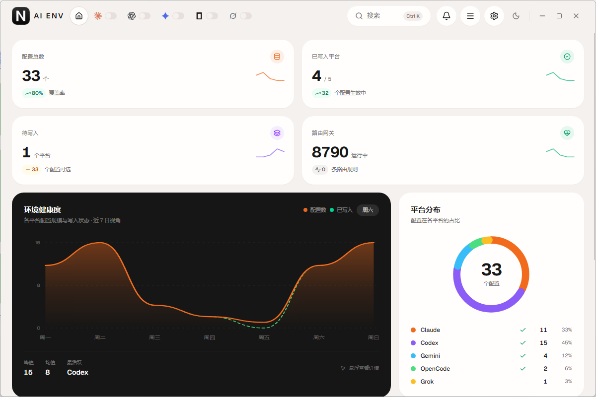

<p align="center">
  
</p>

<h1 align="center">AI ENV</h1>

<p align="center">
  A local desktop workspace for Claude Code, Codex, Antigravity CLI (agy), OpenCode, and Grok.<br />
  Manage environments, MCP servers, skills, a local API router, uptime rotation, cloud backups, and installed CLIs in one window.
</p>

<p align="center">
  <a href="./README.md">中文</a> ·
  <a href="./README_EN.md"><strong>English</strong></a>
</p>

<p align="center"><a href="https://www.nsmao.com">Official website: www.nsmao.com</a></p>

<p align="center">
  <a href="https://github.com/nsmao-com/claude-code-env-change/releases"></a>
  <a href="./LICENSE"></a>
  
  
  
  
</p>

<p align="center">
  
</p>

## What it is

One native window for five CLI toolchains: environment variables, MCP servers, Skills, prompt files, usage stats, and local installs. Everything stays on disk unless you opt into S3-compatible backup. No third-party account is required to run the app.

The current version is the latest version listed in [GitHub Releases](https://github.com/nsmao-com/claude-code-env-change/releases).

## Features

| Module | What it does |
| --- | --- |
| Environments | Multiple profiles, per-tool filter, drag reorder, one-click apply, latency probe, drag-and-drop JSON import |
| MCP | stdio / HTTP servers, sync into Claude Code / Claude Desktop / Codex / Antigravity / OpenCode / Grok (remote servers reach Claude Desktop through an `npx mcp-remote` bridge, which needs Node.js); remote servers can sign in with OAuth once, after which every tool reaches them through the local gateway with the token added; built-in image generation and web search (Tavily / Brave / Exa / Bocha) MCP servers |
| Skills | Edit `SKILL.md`, import from online marketplaces or the bundled library, enable per platform |
| API router | Local gateway port and per-vendor switches; all five CLIs can convert between Anthropic Messages, Chat Completions, and Responses; each route can list backup upstreams that take over on rate limits, dead keys, or outages; LAN sharing with gateway keys (disable / rotate / restrict routes / daily, weekly or monthly token or cost caps); curl, Python, Node and environment-variable snippets; Chat and Anthropic clients can also use Responses-only upstreams; a Gemini-protocol entry lets Gemini CLI and similar clients use any upstream; backup upstreams can use the Codex (ChatGPT), GitHub Copilot or Claude subscription already signed in on this machine (Claude replies are generated by the local claude CLI, the caller's tools bridged over MCP, and later turns of a conversation reuse the process so the prompt cache hits); optional request/response capture (secrets masked), served-by upstream in logs, and OpenTelemetry / Langfuse trace export |
| Uptime | Periodic Base URL checks, optional key verification that catches expired keys or exhausted credit, and rotation groups |
| Cloud sync | S3 / Aliyun OSS / compatible endpoints, scrypt + AES-GCM encrypted objects; local encrypted backup files (`.aienv-backup`) for export / import |
| Prompts | Custom system prompts per CLI |
| Stats | Requests, tokens, cost estimate, model mix, activity heatmap; monthly gateway ledger export to CSV with list-price cost estimates |
| Model catalog | Syncs context window, output limit, pricing and capabilities from models.dev; fill a model's fields in one click; models without a built-in price are costed from the catalog |
| Allowances & balances | 5-hour, weekly and monthly windows of Claude Code / Codex / GitHub Copilot subscriptions; balances for DeepSeek, Moonshot, OpenRouter, SiliconFlow, StepFun, AiHubMix, New API / One API relays and custom endpoints; threshold and low-balance alerts (in-app + system notification); allowance warm-up (a tiny request on a schedule or right after a reset so the next window starts early); allowances in the tray panel |
| Session insights | Prompts, tool calls, skills, MCP, models, projects, hour-of-day and the costliest sessions of Claude Code / Codex over a range; sessions can be moved to a recycle bin and restored |
| More agents | Connect Crush, Kimi CLI, Droid, Pi, Cline, Qwen Code, Gemini CLI, VS Code Chat, Zed, Goose, Command Code, Empryo and ZCode to the local gateway in one click and restore their original config on disconnect; optionally enable RTK for Claude Code / Codex and others to compress command output and save tokens |
| Import links | Registers `aienv://import?...` (same parameters as CC Switch share links); opening one shows a preview and saves nothing until confirmed |
| Settings | Language, theme, accent, text size, outbound proxy; lightweight mode (hands memory back to the system while hidden in the tray); reloads automatically when another program edits the config files |
| Browser mode | `claude-env-switcher web` serves the same interface as a web page with no window, for a NAS or Linux server; listening beyond localhost needs a password; a Dockerfile is included |
| Command line | `claude-env-switcher list / use / quota [wait] / balance / sessions / gateway / gateway-key / catalog sync / mcp / web` to check allowances, switch environments and manage gateway keys from a terminal |
| CLI | Detect local Claude / Codex / Antigravity / OpenCode / Grok; install/upgrade via pnpm, yarn, npm, official installer, or native update |
| Config folders | Open each CLI’s config directory and key files |
| Updates | GitHub Release check; Windows can download and replace in-app |

## 2.8.0 Allowances, gateway upgrades and more agents

- **Allowances & balances**: 5-hour, weekly and monthly windows of Claude Code / Codex / GitHub Copilot subscriptions; balances for DeepSeek, Moonshot, OpenRouter, SiliconFlow, StepFun, AiHubMix and New API / One API relays; threshold alerts, allowance warm-up, allowances in the tray panel.
- **Sessions**: usage insights over a range (prompts, tools, skills, MCP, models, projects, hours); sessions can be moved to a recycle bin and restored.
- **Gateway**: LAN sharing with gateway keys (disable, rotate, restrict routes, daily/weekly/monthly caps); connect snippets; monthly ledger CSV; optional request capture (secrets masked); the upstream an aggregator actually used; OpenTelemetry / Langfuse export.
- **Protocols**: Chat and Anthropic clients can use Responses-only upstreams; a new Gemini-protocol entry lets Gemini CLI use any upstream.
- **Subscription upstreams**: routes and backups can use the Codex (ChatGPT), GitHub Copilot or Claude subscription signed in on this machine; Claude replies come from the local claude CLI with the caller's tools bridged over MCP, and a conversation keeps its process so the prompt cache hits. With several Copilot logins the working one is picked.
- **MCP**: OAuth sign-in for remote servers (tools reach them through the local gateway with the token added); built-in image generation and web search MCP servers.
- **More agents**: connect Crush, Kimi CLI, Droid, Pi, Cline, Qwen Code, Gemini CLI, VS Code Chat, Zed, Goose, Command Code, Empryo and ZCode to the local gateway in one click and restore their config on disconnect; optional RTK.
- **Also**: models.dev catalog; local encrypted backup files (`.aienv-backup`); `aienv://import` links; reload when another program edits the config; text size; lightweight mode.
- **Command line**: `list / use / quota / balance / sessions / gateway / gateway-key / catalog / mcp`, a terminal UI (`tui`) and browser mode (`web`, with a Dockerfile for a NAS or server).

## 2.7.4 Prompt persistence and statistics fixes

- Saving another prompt tab no longer recreates a deleted file; save and delete actions cannot overlap or submit twice.
- Prompt saves verify each file against its submitted snapshot, preserve edits made while saving, and mark them as unsaved. Partial failures leave only remaining changes pending for retry.
- Environment usage is grouped by both tool and name, keeping same-name Claude / Codex environments separate and labeling their tools in the chart.
- Statistics show the selected tool's log directory, list all supported directories in the combined view, and wrap long paths.
- Activity heatmaps include the current week, match local log dates instead of UTC dates, and align weekday labels with their rows.

## 2.7.3 Tool filter fixes

- Fix the shared tool selector ignoring Claude Desktop in Prompts, Statistics, MCP and Skills.
- Show clear availability messages and a way back to supported tools for Claude Desktop prompts, skills and local usage statistics. Unsupported statistics filters no longer display all tools' data.
- Prevent stale statistics requests from overwriting a new selection, allow filter headers to wrap, and correct unsupported rotation-group defaults.

## 2.7.2 Workbench controls

- Use shared app components for workbench selects, inputs, textareas, checkboxes and buttons, with light/dark themes and keyboard support.
- Add a calendar popover with clear and range controls; session filters cover full days in the local time zone.
- Search model suggestions or enter a custom name. Number inputs provide step buttons, decimal precision and range limits.
- Use custom collapsible configuration diffs and in-app form validation feedback.

## 2.7.1 Fixes

- Use black icons throughout the app, system tray and installer.
- Restore Windows tray right-click handling, show a native menu while the panel initializes, and prevent double scaling on high-DPI displays.
- Fix template compilation for workbench session pagination and project editing.

## 2.7 Workbench

- **Sessions**: search local Claude Code, Codex and Gemini sessions with tool, project and date filters; paginate messages, export Markdown, open folders and resume through Claude/Codex CLI (Gemini is view/export only). AI ENV archives only hide entries in its list; native Codex archives remain read-only.
- **Models**: discover and test models, save context/output/compaction limits and input/output/cache prices. Codex supports model catalogs and official-login, API and keep-login modes; keep-login stores credentials under the selected provider.
- **Diagnostics and history**: inspect CLI availability, syntax, drift and optional network requests. MCP verifies stdio, Streamable HTTP and SSE using `initialize → initialized → tools/list`. Keep 100 pre-write snapshots, preview redacted changes and restore selected files with version checks.
- **Full Skills**: import folders, ZIPs and GitHub branches/tags/commits with attachments and executable flags. Review source revisions, per-file changes and platform edits; preserve local edits by default and recover previous central packages through history. Unsafe paths and package symlinks are rejected. Limits: 8 MB per file, 24 MB attachments, 1000 attachments; oversized imports fail explicitly. `.git` and `node_modules` are excluded.
- **Projects and prompts**: reusable prompt library and environment/model/MCP/Skills/prompt presets. Applying saves a snapshot first and switches the tool's global configuration, affecting other projects using that tool. Partial failures are reported and can be recovered through history.
- **Providers**: preview CC Switch JSON, share links (including base64 JSON / Codex TOML) and AI ENV exports. A universal provider creates linked environments across tools; apply the saved environments separately.
- **Gateway and costs**: priority, weighted and session routing; failure thresholds, cooldown and request-triggered recovery probes. View upstream health, actual token usage and streaming time to first token. Estimate USD costs with custom prices and multipliers, receive daily/monthly budget alerts and query OpenRouter / DeepSeek balances. Budgets do not block traffic.
- **Logs and cloud**: incremental Claude/Codex usage parsing and WebDAV support. ETag conditional uploads prevent overwrites. Restore previews redact credentials and allow file selection; local or remote edits invalidate the preview. Safe sync requires HEAD, ETag and conditional PUT support.

Gateway costs only include reported usage with a unique matching price profile. Ledgers rotate monthly and retain the current and two preceding months. CLI estimates use the environment activation timeline and remain separate to avoid double counting. Model test requests may incur provider charges.

New local data is stored in `~/.claude-env-switcher/`: `workbench.json` for profiles/presets/budgets, `history/` for original configuration snapshots (including credentials), and `gateway-usage.jsonl` for current-month usage without request bodies. Previews redact credentials; protect snapshots like original configuration files and use a cloud encryption passphrase.

Development verification uses an isolated home and local mock upstreams with real Wails/Vite dev and file writes. Regression checks: `go test ./...`, `go vet ./...`, and `cd frontend && pnpm exec vue-tsc --noEmit`.

## Install

Download and run the Windows installer from [Releases](https://github.com/nsmao-com/claude-code-env-change/releases):

```
claude-env-switcher-windows-amd64-installer.exe
```

The installer uses the application icon and lets you choose Start menu and desktop shortcuts separately. Upgrades and reinstalls reuse the previous installation directory, and the installer adds the [WebView2](https://developer.microsoft.com/microsoft-edge/webview2/) runtime when it is missing.

macOS and Linux can be built from source.

## Build from source

**Needs**

- Go 1.22+
- Node.js 18+ with **pnpm** only
- [Wails v2 CLI](https://wails.io)

```bash
git clone https://github.com/nsmao-com/claude-code-env-change.git
cd claude-code-env-change
go install github.com/wailsapp/wails/v2/cmd/wails@latest
cd frontend && pnpm install && cd ..
wails dev
```

Production build (NSIS is required for the Windows installer):

```bash
wails build -platform windows/amd64 -nsis -webview2 download
```

Output lands in `build/bin/`.

## Browser mode and Docker

Serve the same interface in a browser with no desktop window (for a NAS or Linux server):

```bash
claude-env-switcher web
```

It listens on `127.0.0.1:3430` by default. To let other machines in, set a password:

```bash
claude-env-switcher web --addr 0.0.0.0:3430 --password your-password
```

Or run it in Docker (the image's home directory is `/data`, so all config lives in that volume):

```bash
docker build -t aienv .
```

```bash
docker run -d --name aienv -p 3430:3430 -e AIENV_WEB_PASSWORD=your-password -v aienv-data:/data aienv
```

Inside the container the gateway listens on localhost only; to serve other machines, turn on LAN sharing on the Routing page, create a gateway key and publish port `18790`. In browser mode, exports download straight to your browser and imports open a file picker in the page; the file is uploaded to the machine running AI ENV.

## Where data lives

```
~/.claude-env-switcher/
  config.json            environments
  mcp.json               MCP servers
  skills.json            skills index
  outbound-proxy.json    outbound proxy
  session-trash/         session recycle bin (deleted for good only when emptied)
  models-catalog.json    models.dev catalog cache
  mcp-oauth.json         MCP OAuth tokens
  agents.json            agents' original config before connecting, restored on disconnect
  ui.json                interface preferences such as lightweight mode
```

Files written into each CLI:

| Tool | Path |
| --- | --- |
| Claude Code | `~/.claude/settings.json` |
| Codex | `~/.codex/config.toml`, `~/.codex/auth.json` (`CODEX_HOME`) |
| Claude Desktop (MCP) | `claude_desktop_config.json` in `%APPDATA%\\Claude` (Microsoft Store build: `%LOCALAPPDATA%\\Packages\\Claude_*\\LocalCache\\Roaming\\Claude`) or `~/Library/Application Support/Claude` |
| Antigravity CLI | `~/.gemini/antigravity-cli/settings.json`, `~/.gemini/config/mcp_config.json`; API key & endpoint are written to user environment variables (agy only reads env vars) |
| OpenCode | `~/.config/opencode/opencode.json` (`OPENCODE_CONFIG_DIR` / `OPENCODE_CONFIG`) |
| Grok | `~/.grok/config.toml` (`GROK_HOME`) |

A writable `config.json` next to the executable, left over from older builds, is still honored.

## Architecture

```
┌─────────────────────────────────────────────┐
│  Vue 3  ·  Pinia  ·  shadcn-vue  ·  Tailwind 4 │
│  motion-v  ·  Chart.js  ·  CodeMirror        │
└──────────────────────┬──────────────────────┘
                       │ Wails bindings
┌──────────────────────▼──────────────────────┐
│  Go  ·  Wails v2                             │
│  env / MCP / skills / local API gateway      │
│  uptime rotation / OSS sync / CLI upgrades   │
└─────────────────────────────────────────────┘
```

The local gateway translates Anthropic Messages, OpenAI Chat Completions, and OpenAI Responses. All five CLIs can select a target upstream format, so one upstream key can feed multiple CLIs. Keys never leave the machine unless you enable cloud sync.

## Stack

| Layer | Choice |
| --- | --- |
| Desktop | Wails v2, WebView2 |
| Frontend | Vue 3, Pinia, Vite 5, TypeScript |
| UI | shadcn-vue (Reka UI), Tailwind CSS 4, Lucide |
| Motion | motion-v |
| Backend | Go 1.22, pelletier/go-toml, json5 |

## Security

- Default path is local disk only.
- Cloud sync uses credentials you supply; objects are encrypted with AES-GCM under a scrypt-derived key. With a passphrase set, an unencrypted backup in the bucket is refused rather than restored.
- By default the local router gateway only accepts non-browser requests addressed to 127.0.0.1 / localhost, so web pages cannot spend your API keys through it. With LAN sharing on, other computers must send a valid gateway key, which is never forwarded upstream.
- On macOS / Linux, local files that hold keys (`config.json`, `mcp.json`, `cloud.json`, …) are written with mode 600.
- API keys are masked in lists and shown in full only in the editor.
- MCP OAuth tokens stay in the local `mcp-oauth.json`; tools get the local gateway address, never the token. Captured request bodies have secrets masked.
- Do not commit `config.json` or exported backups.

## Development notes

- Frontend installs go through pnpm, not npm or yarn.
- Import components from `frontend/src/components/ui/` instead of hand-rolling buttons, inputs, or dialogs.
- The window is frameless; the title bar owns dragging and window controls.

## Contributing

Issues and pull requests: [nsmao-com/claude-code-env-change](https://github.com/nsmao-com/claude-code-env-change). Keep the shadcn component set and the top navigation when touching UI.

Release notes live on [Releases](https://github.com/nsmao-com/claude-code-env-change/releases), not in this file.

## License

[MIT](./LICENSE)
